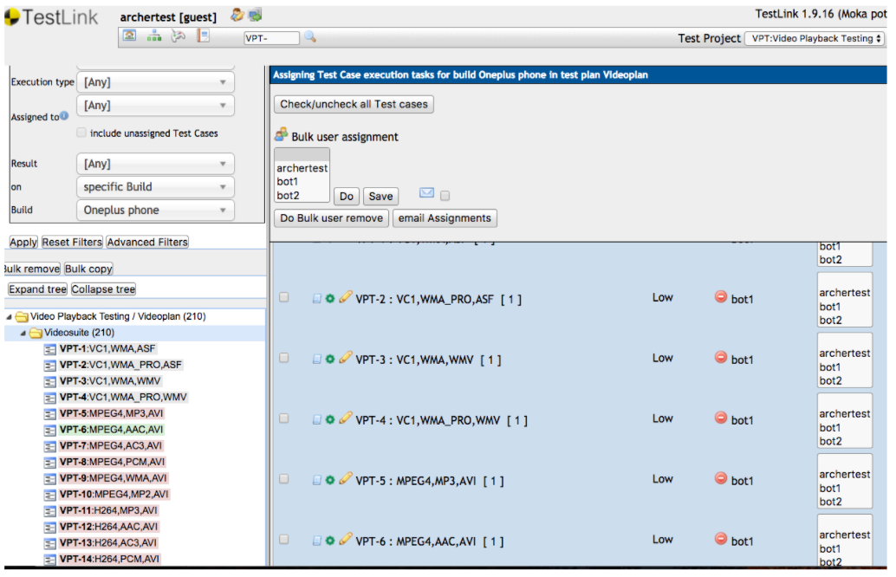
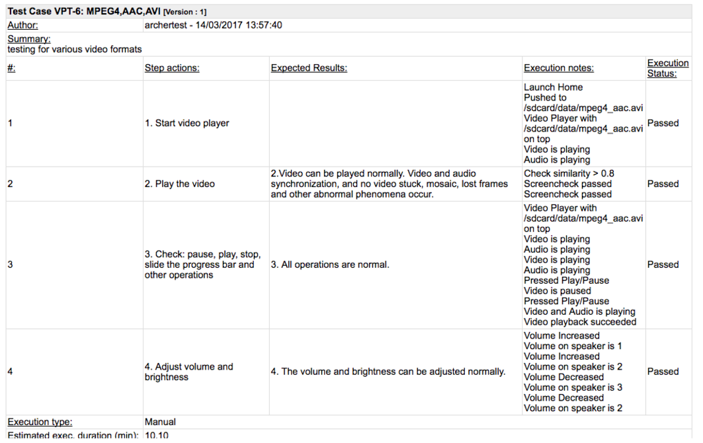

Android Hardware Documentation
==============================

# [Docker Setup](/docker-setup.md)
# [Configuration Setup](/configuration-setup.md)

# Working with Testlink

A current version of testlink is hosted at http://tl.moquality.com (username: archertest, password: testlink). Test cases are pre-loaded and can be viewed in Test Specification tab. 

- Create a Build using Build/Releases tab on the right. The build name has to be mentioned in the config file as well.
- After creating a Build, an administrator must assign the test cases to a user. Assigning test cases is done using Assign Test Case Execution.
- Test cases are executed automatically by our program. It checks periodically if there are any new tests assigned.
- In the report, a user can see the details of the substeps for each test case. If all the test cases are executed correctly, the test case is passed.

## Example Output from a Test Case

# Appendix A

## config.yml configuration

- config.yml resides in the main directory project android_tests
- Obtain the api_server and api_key from MoQuality.
- First field is device_1. This field represent the device id and is unique to every phone. A user must enter the valid device id. The device id is obtained using the command  “adb devices” inside the docker machine.
- Next few fields are “testlink_url”,  “testlink_key”, “testlink_tester” (default is bot 1). These details are filled beforehand and need not to be changed.
- Next field is “project_name”. Default name is “Video Playback Testing”. It can be changed, but a project with the same name must be created in the Testlink.
- Next field is “Testplan_name”. Default name is “Videoplan”.
- Next field is “Build name”. Administrator must create a build on the Testlink (instructions given below) and enter the name of the build here. The test results will be updated for a build. 

